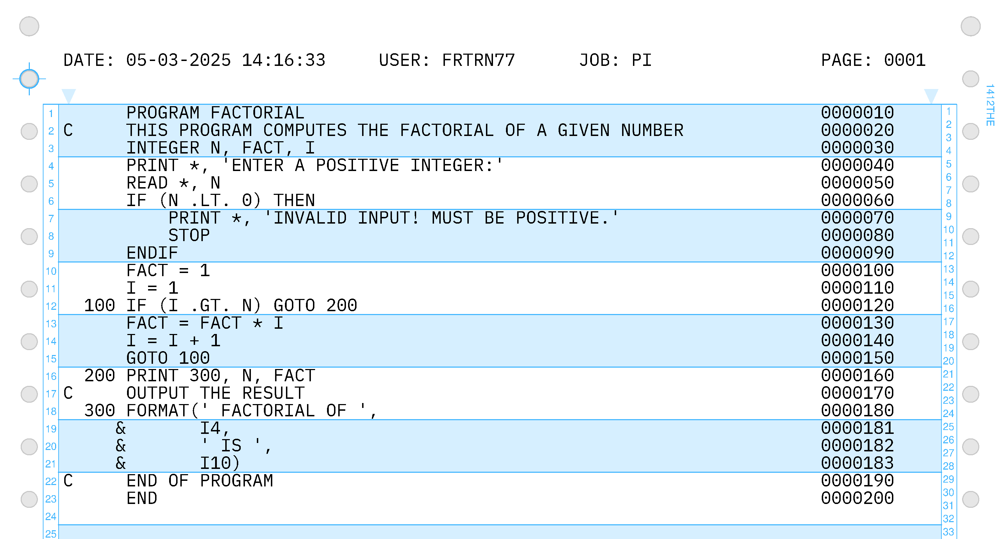
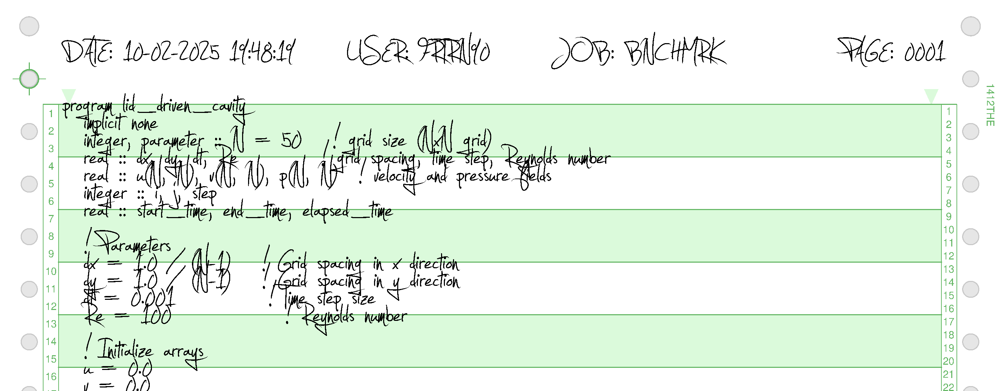

# prt1403

Print a text file to PDF in IBM 1403 retro style

Examples of what can be done with prt1403 can be found at https://github.com/Pynckels/prt1403/tree/main/tests/testOut

The commands to create the examples can be found at https://github.com/Pynckels/prt1403/blob/main/tests/runtests.sh

### Note

This is a work in progress, constructive comments are appreciated.

### Installing

#### Linux

The easiest way to install prt1403 is as follows.

    mkdir -p ~/.local/bin
    git clone https://github.com/Pynckels/prt1403.git
    pip install -r ./prt1403/requirements.txt
    mv ./prt1403/prt1403 ~/.local/bin/prt1403
    chmod +x ~/.local/bin/prt1403
    rm -r prt1403

If running the program does not function, logging out and back in can help to update your $PATH.

#### Mac & Windows

Contact me and we'll cook something up together.

### Syntax

To get the command line syntax the -h and the --help option can be used.

    prt1403 --help

This results in the following information.

    usage: prt1403 [-h] [-c {BLUE,GRAY,GREEN,WHITE}] [-d {YMD,MDY,DMY}] [-e] [-f FONT] [-i NAME] [-j jobID] [-l] [-n]
                   [-o <Output file>] [-p POINTS] [-s {SMALL,MEDIUM,WIDE}] [-u userID] [-v] [-y]
                   <Input file>

    Print a text file to PDF in IBM 1403 retro style

    positional arguments:
      <Input file>          File to process or - for stdin.

    options:
      -h, --help            show this help message and exit
      -c, --color {BLUE,GRAY,GREEN,WHITE}
                            Color of form preprint. Text color is black.
      -d, --datefmt {YMD,MDY,DMY}
                            Date format on header.
      -e, --separator       Print separator page.
      -f, --font FONT       Choose between FONT1403, FONTMONO or an installed font.
      -i, --filename NAME   Override file name/path on separator page.
      -j, --jobid jobID     Job identifier (1 to 8 alphanumeric characters).
      -l, --linenum         Print line numbers.
      -n, --noheader        Disable printing of page headers.
      -o, --outfile <Output file>
                            Output file name.
      -p, --points POINTS   Size of font in points (e.g. 10). Not used for FONT1403 or FONTMONO.
      -s, --size {SMALL,MEDIUM,WIDE}
                            Paper width 9.5", 12" or 14.5". Paper height is 11"
      -u, --userid userID   User identifier (1 to 8 alphanumeric characters).
      -v, --version         Show program version and exit.
      -y, --overwrite       Overwrite output file.

### Fonts

The default font is `FONTMONO` (IBMPlexMono-Regular.ttf) which comes with this program.

    prt1403 -o example.pdf example.txt

There is also the choice for `FONT1403` (IBM140310Pitch-Regular-MRW.ttf) which also comes with this program. The latter has a limited character set, but is a very good representation of the original 1403 printer chain. To use `FONT1403` you can use the option -f/--font.

    prt1403 -f FONT1403 -o example.pdf example.txt

Note that the option -p/--points is disregarded when using the fonts `FONTMONO` or `FONT1403`.

If you want to use fonts that are installed on your pc, that's also possible. To find the installed fonts on Linux, you can use the following commands:

    fc-list | grep -ioP '.*\.(otf|ttf)(?=:)'

To use an installed font and resize it you can use the option -f/--font and -p/--points to scale the font.

    prt1403 -s SMALL -f '/usr/share/fonts/truetype/Jellyka_Estrya_Handwriting/Jellyka_Estrya_Handwriting.ttf' -p 38 -o example.pdf example.txt

This looks like:

### Print multiple files from stdin

The input of prt1403 can be a file or the standard input (stdin). To send a file to prt1403 through stdin, one can use the command:

    prt1403 -o example.pdf - < example.txt

or the command:

    cat example.txt | prt1403 -o example.pdf -

To send multiple files to prt1403 and give them each a seperatorpage with file number, the files have to be separated with a file separator (FS) character. One can use the following command to put FS characters in the stdin stream:

    (cat example1.txt; echo -ne '\x1C'; cat example2.txt; echo -ne '\x1C'; cat example3.txt) | prt1403 -e -o example.pdf -

To get input from the stdin stream and send output to the stdout stream, one can use the command:

    ... | prt1403 -o - - | ...

### Print multiple listings from a file

It is possible to print multiple listings, each with their own separator page and number from a single file. In that case, each listing has to be separated from the next listing with a file separator (FS, 0x1C) character. An example can be found at tests/testIn/test5.asc

### License

Copyright (c) 2025 by Filip Pynckels

This file is part of the prt1403 project that can be found at
https://github.com/Pynckels/prt1403

prt1403 is free software: you can redistribute it and/or modify
it under the terms of the GNU General Public License as published by
the Free Software Foundation, either version 3 of the License, or
(at your option) any later version.

prt1403 is distributed in the hope that it will be useful,
but WITHOUT ANY WARRANTY; without even the implied warranty of
MERCHANTABILITY or FITNESS FOR A PARTICULAR PURPOSE. See the
GNU General Public License for more details.

You should have received a copy of the GNU General Public License
along with prt1403. If not, see <https://www.gnu.org/licenses/>.

### Acknowledgements

***virtual1403*** : This project is inspired by, and uses logic from the virutal1403 project of Matthew R. Wilson that can be found at https://github.com/racingmars/virtual1403

***IBM font*** : This project uses the IBMPlexMono-Regular font. It is licensed under IBMPlexMono-Regular.license

***1403 font*** : This project uses the IBM140310Pitch-Regular-MRW font. It can be found at https://ibm-1401.info/1403Fonts.html#Fonts
